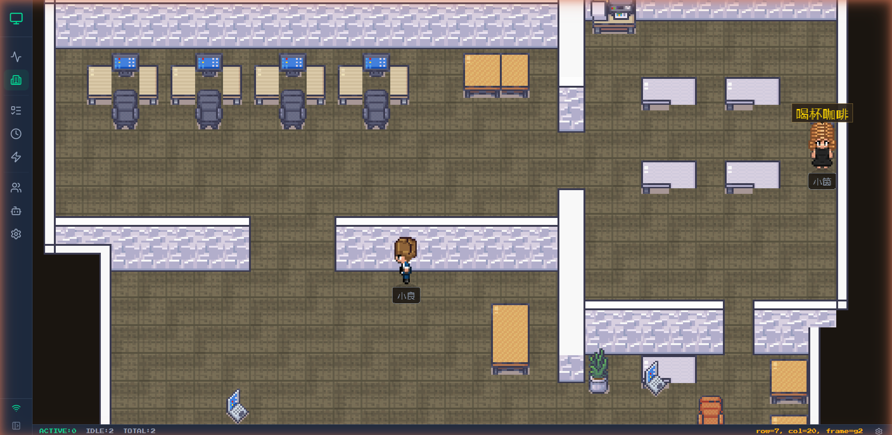
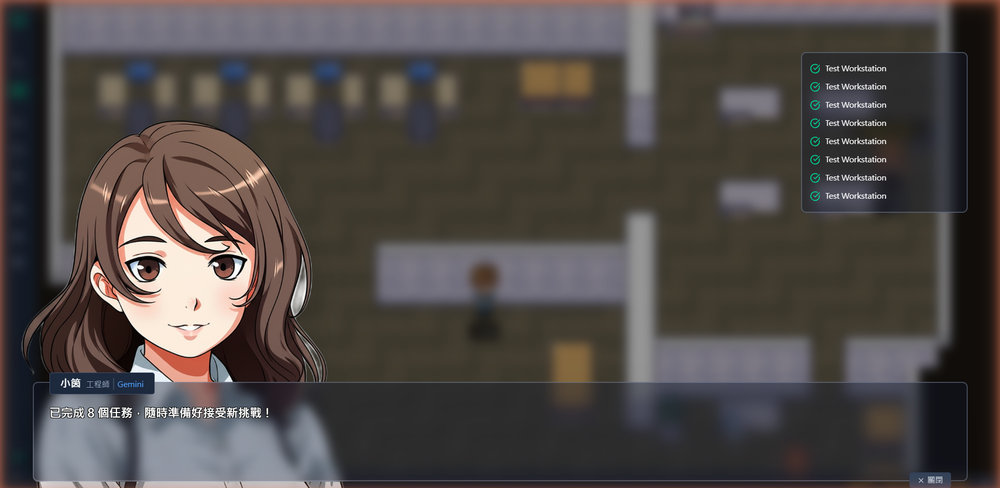
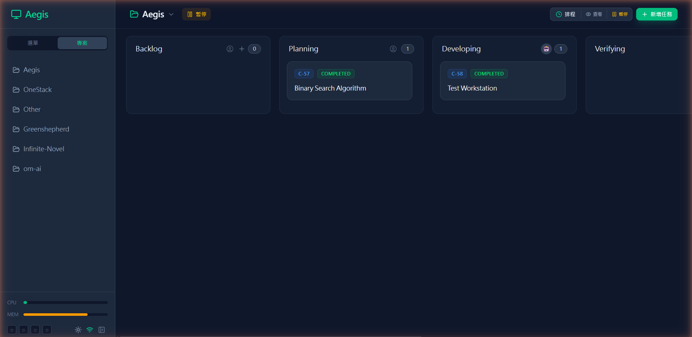

# Aegis — AI Engineering Grid & Intelligence System

**Aegis（神盾）** 是一個全端 AI 開發團隊調度與任務管理平台，專為多重 AI 代理（Claude、Gemini）設計的原生工作環境。

## Screenshots

### Virtual Office
像素風辦公室，AI 角色在工作台工作、茶水間閒晃，有 A* 尋路動畫。



### Character Dialog (AVG Style)
點擊角色開啟 AVG 風格對話框，顯示 AI 生成的日系動漫立繪與任務歷史。



### Kanban Board
拖曳式看板管理，卡片自動流轉，即時顯示 AI 任務狀態。



## Architecture

```
┌──────────────────────────────────────────────────────────┐
│                     Vue 3 Frontend                        │
│  Office │ Dashboard │ Kanban │ CronJobs │ Team │ Settings │
│  Phaser 3 (Pixel Art Office) ←── Pinia ──→ WebSocket     │
└───────────────────────┬──────────────────────────────────┘
                        │ HTTP / WS
┌───────────────────────┴──────────────────────────────────┐
│                   FastAPI Backend                          │
│  REST API │ WebSocket Broadcast │ Task Poller             │
│  ┌──────────────────────────────────────────────┐        │
│  │             Agent Runner                      │        │
│  │    asyncio.Semaphore (max 3 concurrent)      │        │
│  │    Claude CLI ←→ subprocess ←→ Gemini CLI    │        │
│  └──────────────────────────────────────────────┘        │
│  ┌──────────────────────────────────────────────┐        │
│  │         Portrait Generator                    │        │
│  │    Gemini Flash (分析) → Imagen (生成) → rembg │        │
│  └──────────────────────────────────────────────┘        │
│  SQLite (local.db) │ psutil │ GitPython                   │
└──────────────────────────────────────────────────────────┘
```

## Features

- **Virtual Office** — 像素風辦公室場景，AI 角色在工作台工作、茶水間閒晃，點擊角色可開啟 AVG 風格對話框
- **AI Portrait Generation** — 上傳真人照片，Gemini AI 分析特徵後生成日系動漫風格立繪，自動去背
- **Kanban Board** — 拖曳式看板管理，卡片自動流轉（Backlog → Planning → Developing → Verifying → Done）
- **Office Map Editor** — 可視化地圖編輯器，拖放家具、調整佈局，存入後端
- **Multi-AI Routing** — Planning 階段使用 Gemini，Developing 階段使用 Claude，可配置
- **Real-time Monitoring** — WebSocket 每 5 秒廣播系統指標（CPU/RAM/Disk）及運行中任務狀態
- **Log Streaming** — AI subprocess stdout 即時串流至前端終端機
- **Slot-based Concurrency** — 最多 3 個 AI 任務並行，超載自動暫停分派
- **Cron Scheduler** — 內建排程引擎，支援 cron expression 定時觸發任務
- **Claude Usage Tracking** — 多帳號 OAuth 用量查詢（5h/7d 用量、Sonnet/Opus 分類、超額信用）
- **Git Safety** — AI 執行前自動 stash/branch，失敗時可回滾
- **System Settings** — 可配置時區、最大並行數、Gemini API Key 等系統參數
- **Dark/Light Theme** — CSS filter 反轉的極簡主題切換
- **Local-First** — 全部資料存在 SQLite，整個資料夾可攜帶至任何環境

## Tech Stack

| Layer | Technology |
|-------|-----------|
| Frontend | Vue 3 + TypeScript + Vite + Tailwind CSS 4 |
| State | Pinia + WebSocket composable |
| Backend | Python 3.12 + FastAPI + SQLModel |
| Database | SQLite (`local.db`) |
| Real-time | WebSocket (native FastAPI) |
| AI Providers | Claude Code CLI + Gemini CLI (subprocess) |
| Monitoring | psutil (CPU/RAM/Disk) |
| Icons | lucide-vue-next |

## Getting Started

### Prerequisites

- Python 3.12+
- Node.js 18+ & pnpm
- Claude Code CLI (`claude`) and/or Gemini CLI installed

### Backend

```bash
cd backend
python -m venv venv
source venv/bin/activate  # Windows: venv\Scripts\activate
pip install -r requirements.txt

# Seed database (optional)
python seed.py

# Start server
uvicorn app.main:app --host 0.0.0.0 --port 8899 --reload
```

### Frontend

```bash
cd frontend
pnpm install
pnpm dev
```

Open http://localhost:5173

## Documentation

- [API Endpoints](docs/api.md) — REST API 完整列表
- [WebSocket Events](docs/websocket.md) — 即時事件與任務執行流程

## Project Structure

```
aegis/
├── backend/
│   ├── app/
│   │   ├── main.py              # FastAPI app + WebSocket + lifespan
│   │   ├── database.py          # SQLite + SQLModel session
│   │   ├── api/
│   │   │   └── routes.py        # All REST endpoints
│   │   ├── models/
│   │   │   └── core.py          # ORM: Project, Card, StageList, CronJob, Tag, SystemSetting
│   │   └── core/
│   │       ├── runner.py         # AI task executor (async subprocess)
│   │       ├── poller.py         # Pending card dispatcher
│   │       ├── cron_poller.py    # Cron expression scheduler
│   │       ├── ws_manager.py     # WebSocket broadcast manager
│   │       ├── telemetry.py      # System metrics (psutil)
│   │       ├── claude_usage.py   # Claude OAuth usage API
│   │       ├── git_safety.py     # Git stash/branch/rollback
│   │       └── portrait_generator.py  # AI portrait generation (Gemini + rembg)
│   ├── requirements.txt
│   ├── seed.py
│   ├── import_trello.py          # Migration: Trello → Aegis
│   └── import_supabase_cron.py   # Migration: Supabase → Aegis
├── frontend/
│   ├── src/
│   │   ├── App.vue               # Layout + sidebar (menu/projects mode)
│   │   ├── views/
│   │   │   ├── Office.vue        # Pixel art virtual office (Phaser 3)
│   │   │   ├── Dashboard.vue     # System metrics + Claude usage + running tasks
│   │   │   ├── Kanban.vue        # Project board with card management
│   │   │   ├── CronJobs.vue      # Cron job CRUD
│   │   │   ├── Team.vue          # Team members + AI portrait generation
│   │   │   ├── Agents.vue        # Live AI agent status
│   │   │   └── Settings.vue      # System settings (timezone, Gemini API key)
│   │   ├── stores/
│   │   │   └── aegis.ts          # Pinia: tasks, system info, logs, toasts
│   │   ├── composables/
│   │   │   └── useWebSocket.ts   # Singleton WS with auto-reconnect
│   │   ├── components/
│   │   │   ├── CharacterDialog.vue   # AVG-style character dialog
│   │   │   ├── OfficeEditor.vue      # Map editor for office layout
│   │   │   ├── RunningTaskCard.vue
│   │   │   ├── TerminalViewer.vue
│   │   │   ├── ConfirmDialog.vue
│   │   │   └── ToastNotification.vue
│   │   └── game/
│   │       ├── OfficeScene.ts        # Phaser scene with A* pathfinding
│   │       ├── EditorScene.ts        # Map editor scene
│   │       ├── types.ts              # Office layout types
│   │       ├── layoutManager.ts      # Layout serialization
│   │       └── defaultLayout.ts      # Default office configuration
│   ├── package.json
│   └── vite.config.ts
├── .gitignore
└── README.md
```

## Vision

Aegis 的定位是「AI 開發團隊的調度中心」。不只是看板工具，而是一個原生支援 AI 代理的工作平台：

- **Tag-driven dispatch** — 卡片標籤決定路由：`[AI-Planning]` → Gemini，`[AI-Coding]` → Claude
- **Heartbeat triage** — 定期心跳檢查未處理事件，低成本 AI 分流後自動建卡
- **Omni-channel** — 未來整合 Telegram/LINE，支援遠端建卡、狀態查詢、中止任務
- **Cost analytics** — 跨專案、跨引擎的 Token 消耗與成本追蹤

## License

MIT License — see [LICENSE](LICENSE) for details.
